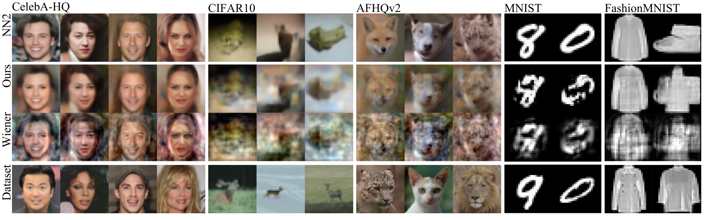

<p align="center">
  This is the official implementation of the paper
</p>

<div id="user-content-toc" display="inline">
  <ul align="center" style="list-style: none;">
    <summary>
      <h1>Locality in Image Diffusion Models Emerges from Data Statistics</h1>
    </summary>
  </ul>

<p align="center">
  <a href="https://arxiv.org/abs/2509.09672">
    
  </a>
  <a href="https://locality.lukoianov.com">
    
  </a>
</p>

<p align="center">
    <a class="active text-decoration-none" href="https://lukoianov.com">Artem Lukoianov</a><sup> 1</sup>,  &nbsp;
    <a class="active text-decoration-none" href="https://chenyang.co">Chenyang Yuan</a><sup> 2</sup>, &nbsp;
    <a class="active text-decoration-none" href="https://people.csail.mit.edu/jsolomon/">Justin Solomon</a><sup> 1</sup>, &nbsp;
    <a class="active text-decoration-none" href="https://www.vincentsitzmann.com">Vincent Sitzmann</a><sup> 1</sup>
</p>
<p align="center">
  <span class="author-block"><sup>1 </sup>Massachusetts Institute of Technology,</span>&nbsp;
  <span class="author-block"><sup>2 </sup>Toyota Research Institute</span>
</p>

<p align="center">
  For any questions please shoot an email to <a href="mailto:arteml@mit.edu">arteml@mit.edu</a>
</p>

<p align="center">
  
</p>

> [!NOTE]
> 🐛 **Help us improve!** We've noticed inconsistent generation on different systems. If you encounter any bugs, inconsistent behavior, or have suggestions, please [open an issue](https://github.com/ottogin/locality-in-diffusion-models/issues). Your feedback is valuable!

## Models

The repository implements several analytical diffusion models:

1. **`pca_locality`** (Main method): Our proposed analytical denoiser that captures locality from data statistics.
2. **`optimal`**: The theoretically optimal denoiser (reproduces training images).
3. **`wiener`**: Wiener filter-based denoiser.
4. **`nearest_dataset`**: Baseline that retrieves the nearest dataset image at each step.

## Datasets

Supported datasets:
- `mnist`: MNIST handwritten digits
- `fashion_mnist`: Fashion-MNIST
- `cifar10`: CIFAR-10
- `celeba_hq`: CelebA-HQ
- `afhq`: AFHQv2

Most datasets auto-download. 
For `celeba_hq` and `afhq`, so please download them manually and place data in `data/datasets/`.

## Environment Setup

### Prerequisites

- Python 3.9 or higher
- [uv](https://github.com/astral-sh/uv) package manager.
- [Recommended] CUDA-capable GPU -- if you dont have it, make sure to change the device in the config to CPU/MPS

### Installation
No manual setup required! Just use `uv run` directly.

<details>
<summary>Alternative: Manual installation</summary>

If you prefer to set up the environment manually:

```bash
uv venv
source .venv/bin/activate  # On Linux/Mac (.venv\Scripts\activate on Windows)
uv pip install -e .
```
</details>


### Download the baseline UNET weights and the data
First we need to run this script to download the weights of the UNET models pre-trained for all of the baseline datasets.
It 
You can skip this step, but then the metrics wont be available -- make sure to disable `baseline_path` in the config.

```bash
uv run download_baseline_weights.py
```

## Running Experiments

### Single Experiment

Now, run the command below to generate images with our analytical model.
UV will automatically create the virtual environment and install all dependencies (including the package in editable mode):

```bash
uv run generate.py --config configs/pca_locality/celeba_hq.yaml
```

The config path can be:
- Relative to `configs/` directory: `pca_locality/celeba_hq.yaml`
- Absolute path: `/path/to/config.yaml`

### Batch Experiments

Run all baseline-dataset combinations using the provided script:

```bash
./run_all.sh
```

This script iterates over:
- **Baselines**: `pca_locality`, `optimal`, `wiener`, `nearest_dataset`
- **Datasets**: `afhq`, `celeba_hq`, `cifar10`, `fashion_mnist`, `mnist`

It automatically skips missing config files and runs each experiment sequentially.


## Configuration Files

Configuration files use YAML format with OmegaConf's `defaults` feature for inheritance. Each config inherits from `configs/defaults.yaml` and can override specific values.

### Configuration Structure

A typical config file (`configs/pca_locality/celeba_hq.yaml`) looks like:

```yaml
defaults:
  - /defaults.yaml

# Run metadata: name, seed, device, tags
experiment:
  run_name: pca_locality_celeba_hq  # Name of the run - overwritten in each individual config file
  tags: [baseline, pca_locality, celeba_hq]  # Tags for experiment organization
  seed: 42  # Random seed for reproducibility
  device: cuda  # Device to run on (cuda/cpu/mps)

# Dataset configuration: name, split, resolution, batch size
dataset:
  name: celeba_hq  # Dataset name (mnist, cifar10, celeba_hq, afhq, fashion_mnist)
  split: train  # Dataset split to use
  download: false  # Whether to auto-download (set false for manual downloads)
  batch_size: 256  # Batch size for dataset loading
  resolution: 64  # Image resolution (overrides default if specified)

# Model selection and hyperparameters
# Available models: pca_locality, optimal, wiener, nearest_dataset
model:
  name: pca_locality  # Model to use
  params:
    temperature: 1.0  # Temperature parameter for softmax weighting
    mask_threshold: 0.02  # Threshold for mask binarization

# Generation parameters: number of samples, inference steps
sampling:
  num_samples: 8  # Total number of samples to generate
  batch_size: 8  # Batch size for generation
  num_inference_steps: 10  # Number of diffusion steps

# Output and logging settings: WandB, file saving
metrics:
  baseline_path: "data/models/baseline_unet/celeba_hq/ckpt_epoch_200.pt"  # Path to baseline UNet checkpoint for comparison
  output:
    save_final_images: true  # Save individual sample images
    save_image_grid: true  # Save grid of all samples
    save_intermediate_images: true  # Save intermediate diffusion steps
  wandb:
    enabled: true  # Enable Weights & Biases logging
    project: locality-diffusion  # WandB project name
```

### Config Overrides via CLI

You can override any config value from the command line using dot notation:

```bash
uv run generate.py --config configs/pca_locality/celeba_hq.yaml \
    sampling.num_samples=16 \
    model.params.temperature=0.5\
    experiment.device=cpu
```

## Output Structure

Each experiment creates a run directory with the following structure:

```
data/runs/{experiment_name}/{run_name}_{optional:timestamp}/
├── config.yaml              # Saved configuration
├── grid.png                 # Grid of generated samples
├── metrics.json             # Computed metrics
├── logs/
│   └── generate.log         # Execution log
├── artifacts/
│   ├── images/              # Individual sample images
│   │   └── sample_0000.png
│   ├── intermediate_images/ # Intermediate diffusion steps
│   │   ├── x_t/            # Noisy images at each step
│   │   └── x0_pred/        # Predicted clean images at each step
│   └── comparison/          # Comparison grids (if baseline_path set)
└── code_snapshot/           # Git-tracked code snapshot
```


## Weights & Biases Integration

WandB logging is enabled by default. Using WandB is convinient for studying generation results, but can slowdown the runs. To disable or configure:

```yaml
metrics:
  wandb:
    enabled: false  # Disable WandB
    mode: offline   # Use offline mode
    project: my-project
```


## Contributing

We welcome contributions to this repository! Here are some ways you can help:

### Reporting Issues

If you encounter bugs or have suggestions for improvements, please open an issue on GitHub. When reporting bugs, please include:
- A clear description of the problem
- Steps to reproduce the issue
- Your environment details (Python version, OS, etc.)
- Relevant error messages or logs

### Contributing Code

1. **Fork the repository** and create a new branch for your changes
2. **Follow the code style**: The project uses standard Python conventions. Ensure your code is well-documented and follows the existing patterns
3. **Add tests** if applicable (though the current codebase focuses on reproducibility of paper results)
4. **Update documentation** if you add new features or change existing behavior
5. **Submit a pull request** with a clear description of your changes

### Adding New Models

To add a new analytical diffusion model:

1. Create a new file in `src/local_diffusion/models/` implementing the `BaseDenoiser` interface
2. Register your model using the `@register_model("model_name")` decorator
3. Add configuration files in `configs/model_name/` for each dataset
4. Update this README to document your model


### Project Directory Structure

The project follows a structured layout:

```
locality-in-diffusion-models/
├── configs/              # Configuration files
│   ├── defaults.yaml     # Base configuration with common defaults
│   ├── pca_locality/     # Configs for the method proposed in our paper
│   ├── optimal/          # Optimal denoiser baseline
│   ├── wiener/           # Wiener filter baseline
│   └── nearest_dataset/  # Nearest neighbor baseline
├── src/
│   └── local_diffusion/  # Main package code
│       ├── models/       # Model implementations (pca_locality.py, etc.)
│       ├── data/         # Dataset loading utilities
│       ├── configuration.py  # Config management
│       └── metrics.py    # Evaluation metrics
├── data/                 # Data directory (created automatically)
│   ├── datasets/         # Dataset storage
│   ├── models/           # Precomputed models (Wiener filters, etc.)
│   ├── runs/             # Experiment outputs
│   └── wandb/            # Weights & Biases logs
├── generate.py           # Main entry point for experiments
└── run_all.sh            # Batch script to run all experiments
```

## Citation

If you find our project useful, please consider citing it:

```bibtex
@inproceedings{lukoianovlocality,
      title={Locality in Image Diffusion Models Emerges from Data Statistics},
      author={Lukoianov, Artem and Yuan, Chenyang and Solomon, Justin and Sitzmann, Vincent},
      booktitle={The Thirty-ninth Annual Conference on Neural Information Processing Systems}
      year={2025},
      primaryClass={cs.CV},
      url={https://locality.lukoianov.com/}, 
}
```
